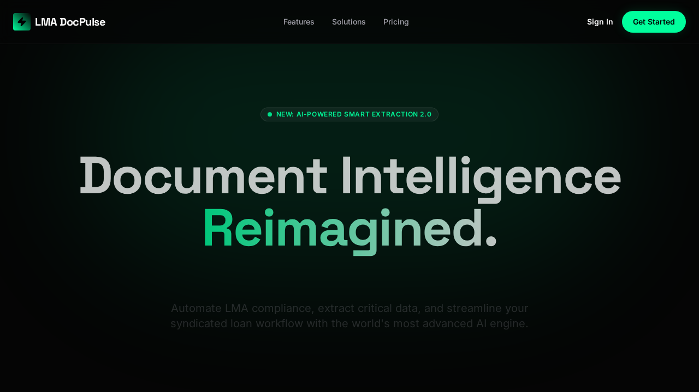
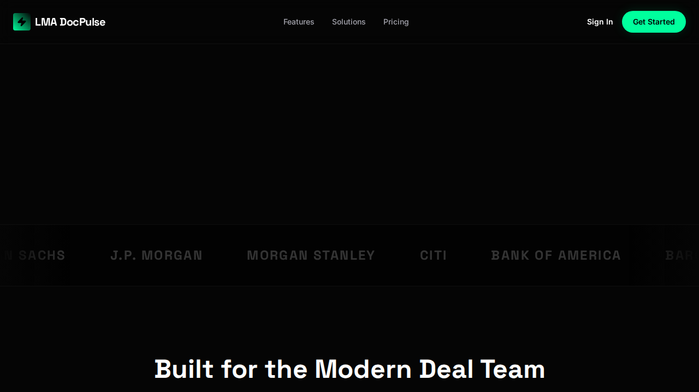
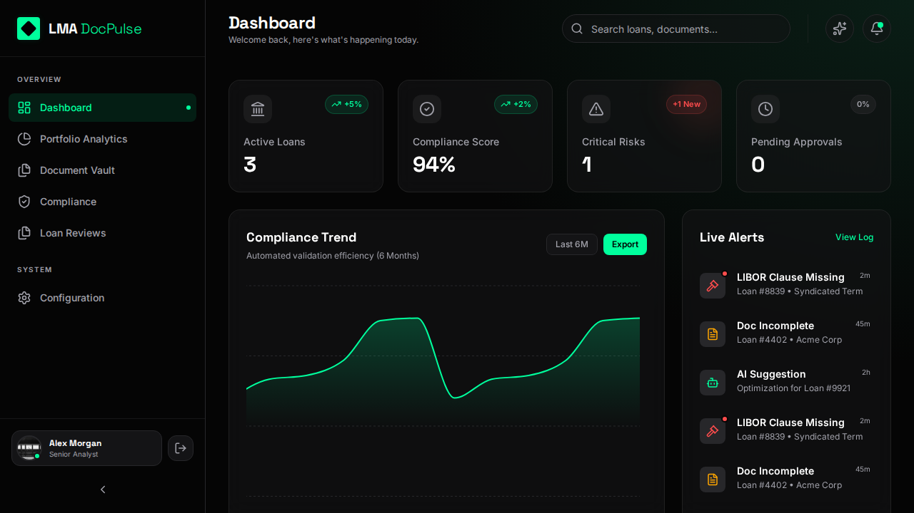
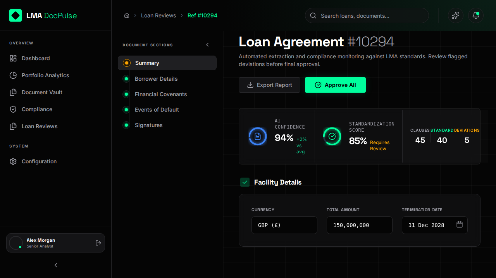
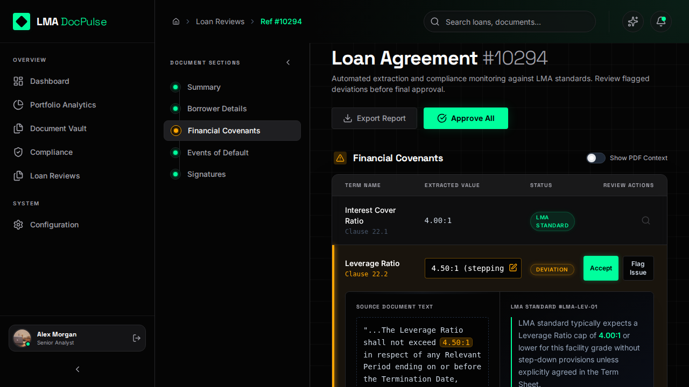
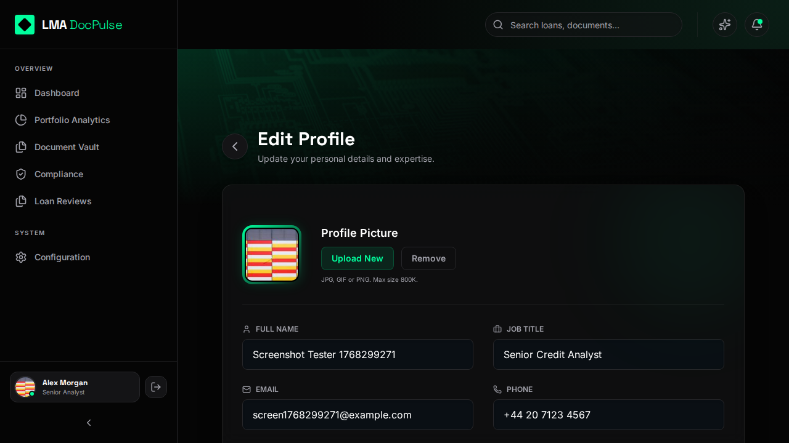

<div align="center">
  
  <h1>🚀 LMA DocPulse</h1>
  <p><strong>AI-Powered Loan Management & Compliance Platform</strong></p>
  <p>Enterprise-grade document analysis, covenant monitoring, and portfolio management for financial institutions</p>
  
  <p>
    
    
    
    
    
  </p>
</div>

---

## 📋 Table of Contents

- [Overview](#-overview)
- [Key Features](#-key-features)
- [Technology Stack](#-technology-stack)
- [Architecture](#-architecture)
- [Project Structure](#-project-structure)
- [Getting Started](#-getting-started)
- [Configuration](#-configuration)
- [Core Modules](#-core-modules)
- [AI Integration](#-ai-integration)
- [Database Schema](#-database-schema)
- [API Reference](#-api-reference)
- [Security](#-security)
- [Performance](#-performance)
- [Deployment](#-deployment)
- [Contributing](#-contributing)
- [Changelog](#-changelog)
- [License](#-license)

---

## 🎯 Overview

**LMA DocPulse** is a cutting-edge, AI-powered loan management and compliance platform designed for financial institutions, banks, and lending organizations. The platform leverages advanced natural language processing to automatically extract, analyze, and monitor loan agreements against LMA (Loan Market Association) standards.

### Mission Statement
> *Transforming loan document management through intelligent automation, reducing manual review time by up to 80% while ensuring 99.9% compliance accuracy.*

### Target Users
- **Commercial Banks** - Loan origination and portfolio management teams
- **Investment Banks** - Syndicated loan administration
- **Private Credit Funds** - Covenant monitoring and compliance
- **Legal Teams** - Document review and risk assessment
- **Compliance Officers** - Regulatory adherence and audit trails

---

## 📸 Visual Verification

### Landing Page & Simulation
<div align="center">
  
  
</div>

### Dashboard & Analytics
<div align="center">
  
</div>

### Loan Review & Compliance
<div align="center">
  
  
</div>

### User Profile
<div align="center">
  
</div>

---

## ✨ Key Features

### 📄 Document Intelligence
| Feature | Description |
|---------|-------------|
| **AI-Powered Extraction** | Automatically extract key terms, covenants, and clauses from PDF loan agreements |
| **LMA Standard Comparison** | Real-time comparison against LMA standard templates |
| **Multi-Format Support** | Process PDF, DOCX, and image-based documents |
| **OCR Integration** | Extract text from scanned documents |

### 📊 Portfolio Analytics
| Feature | Description |
|---------|-------------|
| **Risk Heatmaps** | Visual representation of portfolio risk concentration |
| **Exposure Tracking** | Real-time monitoring of total portfolio exposure |
| **Performance Metrics** | Track loan performance with A-D risk scoring |
| **Trend Analysis** | Historical exposure and risk trend visualization |

### ⚖️ Compliance & Monitoring
| Feature | Description |
|---------|-------------|
| **Covenant Monitoring** | Track financial covenant compliance status |
| **Deviation Detection** | Automatic flagging of non-standard clauses |
| **Alert System** | Real-time notifications for critical issues |
| **Audit Trail** | Complete activity logging for regulatory compliance |

### 🤖 Smart Query (AI Assistant)
| Feature | Description |
|---------|-------------|
| **Natural Language Queries** | Ask questions about your portfolio in plain English |
| **Context-Aware Responses** | AI understands your specific loan data |
| **Document Q&A** | Query individual documents for specific information |
| **Insights Generation** | AI-generated recommendations and insights |

### 📁 Document Vault
| Feature | Description |
|---------|-------------|
| **Centralized Storage** | Secure, organized document repository |
| **Version Control** | Track document versions and changes |
| **Search & Filter** | Advanced search across all documents |
| **Entity Extraction** | Automatic tagging of borrowers, amounts, dates |

### 🔐 Commercial Viability Analysis
| Feature | Description |
|---------|-------------|
| **Value Proposition** | AI assessment of deal value proposition |
| **Scalability Analysis** | Evaluate growth and scalability potential |
| **Risk Mitigation** | Identify and score risk mitigation strategies |
| **Market Opportunity** | Assess market opportunity and competitive advantage |
| **Component Scoring** | 0-100 scoring for each viability component |
| **Editable Insights** | Analysts can refine AI-generated insights |

---

## 🛠 Technology Stack

### Frontend
| Technology | Version | Purpose |
|------------|---------|---------|
| **React** | 19.2.3 | UI Framework |
| **TypeScript** | 5.8.2 | Type Safety |
| **Vite** | 6.2.0 | Build Tool & Dev Server |
| **Tailwind CSS** | 3.x (CDN) | Styling Framework |
| **Framer Motion** | 12.24.12 | Animations |
| **Recharts** | 3.6.0 | Data Visualization |
| **Lucide React** | 0.562.0 | Icon Library |

### AI & Processing
| Technology | Version | Purpose |
|------------|---------|---------|
| **OpenAI GPT-4** | Latest | Document Analysis & NLP |
| **react-pdf** | 10.3.0 | PDF Rendering & Parsing |

### Data Layer
| Technology | Version | Purpose |
|------------|---------|---------|
| **Dexie.js** | 4.2.1 | IndexedDB Wrapper |
| **dexie-react-hooks** | 4.2.0 | React Integration |
| **LocalStorage** | Native | Settings & API Keys |

### Developer Experience
| Technology | Version | Purpose |
|------------|---------|---------|
| **@vitejs/plugin-react** | 5.0.0 | React Fast Refresh |
| **@types/react** | 19.0.10 | TypeScript Definitions |
| **@types/node** | 22.14.0 | Node.js Types |
| **Sonner** | 2.0.7 | Toast Notifications |

---

## 🏗 Architecture

```
┌─────────────────────────────────────────────────────────────────┐
│                        CLIENT BROWSER                            │
├─────────────────────────────────────────────────────────────────┤
│  ┌─────────────┐  ┌─────────────┐  ┌─────────────────────────┐  │
│  │   React     │  │  Tailwind   │  │    Framer Motion        │  │
│  │   19.2.3    │  │    CSS      │  │     Animations          │  │
│  └──────┬──────┘  └──────┬──────┘  └────────────┬────────────┘  │
│         │                │                       │               │
│  ┌──────┴────────────────┴───────────────────────┴──────────┐   │
│  │                    COMPONENT LAYER                        │   │
│  │  ┌──────────┐ ┌──────────┐ ┌──────────┐ ┌──────────────┐ │   │
│  │  │ Sidebar  │ │ Header   │ │StatCards │ │ RiskHeatmap  │ │   │
│  │  └──────────┘ └──────────┘ └──────────┘ └──────────────┘ │   │
│  └──────────────────────────────────────────────────────────┘   │
│                              │                                   │
│  ┌───────────────────────────┴──────────────────────────────┐   │
│  │                      VIEW LAYER                           │   │
│  │  ┌──────────────────────────────────────────────────────┐│   │
│  │  │ Dashboard │ LoanReview │ Analytics │ Compliance │... ││   │
│  │  └──────────────────────────────────────────────────────┘│   │
│  └──────────────────────────────────────────────────────────┘   │
│                              │                                   │
│  ┌───────────────────────────┴──────────────────────────────┐   │
│  │                    SERVICE LAYER                          │   │
│  │  ┌────────────────┐  ┌─────────────────────────────────┐ │   │
│  │  │  OpenAI API    │  │      Document Processing        │ │   │
│  │  │  Integration   │  │      (PDF Parse, OCR)           │ │   │
│  │  └────────────────┘  └─────────────────────────────────┘ │   │
│  └──────────────────────────────────────────────────────────┘   │
│                              │                                   │
│  ┌───────────────────────────┴──────────────────────────────┐   │
│  │                     DATA LAYER                            │   │
│  │  ┌─────────────────┐  ┌────────────────────────────────┐ │   │
│  │  │   Dexie.js      │  │       IndexedDB                │ │   │
│  │  │   (ORM)         │  │   (Browser Storage)            │ │   │
│  │  └─────────────────┘  └────────────────────────────────┘ │   │
│  └──────────────────────────────────────────────────────────┘   │
└─────────────────────────────────────────────────────────────────┘
                              │
                              ▼
              ┌───────────────────────────────┐
              │       EXTERNAL SERVICES        │
              │  ┌─────────────────────────┐  │
              │  │     OpenAI API          │  │
              │  │     (GPT-4 Turbo)       │  │
              │  └─────────────────────────┘  │
              └───────────────────────────────┘
```

---

## 📁 Project Structure

```
lma-docpulse/
├── 📄 index.html              # Entry HTML with Tailwind CDN
├── 📄 index.tsx               # React application entry point
├── 📄 App.tsx                 # Main application component & routing
├── 📄 package.json            # Dependencies & scripts
├── 📄 tsconfig.json           # TypeScript configuration
├── 📄 vite.config.ts          # Vite build configuration
│
├── 📁 src/
│   ├── 📄 db.ts               # Dexie database schema & initialization
│   ├── 📄 vite-env.d.ts       # Vite environment types
│   │
│   ├── 📁 components/         # Reusable UI components
│   │   ├── 📄 Sidebar.tsx           # Main navigation sidebar
│   │   ├── 📄 Header.tsx            # Top header with search & user
│   │   ├── 📄 StatCard.tsx          # Metric display card
│   │   ├── 📄 RiskHeatmap.tsx       # Portfolio risk visualization
│   │   ├── 📄 AlertItem.tsx         # Alert notification component
│   │   ├── 📄 Breadcrumbs.tsx       # Navigation breadcrumbs
│   │   ├── 📄 ConfirmationModal.tsx # Delete/action confirmations
│   │   ├── 📄 ActionFeedback.tsx    # Success/error feedback
│   │   ├── 📄 ScanningFeature.tsx   # Document scanning UI
│   │   └── 📄 AbstractBankUIs.tsx   # Banking UI patterns
│   │
│   ├── 📁 views/              # Page-level components
│   │   ├── 📄 AuthView.tsx            # Login & registration
│   │   ├── 📄 LandingPage.tsx         # Marketing landing page
│   │   ├── 📄 DashboardView.tsx       # Main dashboard
│   │   ├── 📄 UploadView.tsx          # Document upload & analysis
│   │   ├── 📄 DocumentVaultView.tsx   # Document repository
│   │   ├── 📄 DocumentDetailView.tsx  # Single document view
│   │   ├── 📄 LoanReviewsListView.tsx # All loans list
│   │   ├── 📄 LoanReviewView.tsx      # Individual loan analysis
│   │   ├── 📄 PortfolioAnalyticsView.tsx # Portfolio metrics
│   │   ├── 📄 ComplianceView.tsx      # Compliance dashboard
│   │   ├── 📄 SmartQueryView.tsx      # AI chat interface
│   │   ├── 📄 AnalyticsResultView.tsx # Query results
│   │   ├── 📄 FilterView.tsx          # Advanced filtering
│   │   ├── 📄 AlertsLogView.tsx       # System alerts
│   │   ├── 📄 ActivityLogView.tsx     # Activity history
│   │   ├── 📄 ViolationsLogView.tsx   # Compliance violations
│   │   ├── 📄 SettingsView.tsx        # Application settings
│   │   ├── 📄 ProfileView.tsx         # User profile
│   │   ├── 📄 EditProfileView.tsx     # Edit user profile
│   │   ├── 📄 PublicProfileView.tsx   # Shareable profile
│   │   └── 📄 NotificationsView.tsx   # Notification center
│   │
│   ├── 📁 services/           # External service integrations
│   │   └── 📄 openai.ts             # OpenAI API wrapper & prompts
│   │
│   ├── 📁 types/              # TypeScript type definitions
│   │   └── 📄 index.ts              # All application types
│   │
│   ├── 📁 data/               # Static data & mock data
│   │   └── 📄 mockData.ts           # Development mock data
│   │
│   └── 📁 utils/              # Utility functions
│       └── 📄 helpers.ts            # Common helper functions
│
└── 📁 verification/           # Test documents & verification
```

---

## 🚀 Getting Started

### Prerequisites

| Requirement | Version | Download |
|-------------|---------|----------|
| Node.js | 18.x or higher | [nodejs.org](https://nodejs.org) |
| npm | 9.x or higher | Included with Node.js |
| Git | Latest | [git-scm.com](https://git-scm.com) |
| Modern Browser | Chrome 90+, Firefox 88+, Edge 90+ | - |

### Installation

```bash
# 1. Clone the repository
git clone https://github.com/your-org/lma-docpulse.git
cd lma-docpulse

# 2. Install dependencies
npm install

# 3. Set up environment variables (optional)
cp .env.example .env
# Edit .env and add your OpenAI API key

# 4. Start development server
npm run dev

# 5. Open in browser
# Navigate to http://localhost:5173
```

### Build for Production

```bash
# Build optimized production bundle
npm run build

# Preview production build locally
npm run preview

# Output will be in ./dist directory
```

---

## ⚙️ Configuration

### Environment Variables

Create a `.env` file in the project root:

```env
# OpenAI Configuration
VITE_OPENAI_API_KEY=sk-your-api-key-here

# Optional: Custom API endpoint
VITE_OPENAI_BASE_URL=https://api.openai.com/v1

# Feature Flags
VITE_ENABLE_ANALYTICS=true
VITE_ENABLE_AI_CHAT=true
VITE_DEBUG_MODE=false
```

### Runtime Configuration

API keys can also be configured at runtime through:
- **Settings Page**: Navigate to Settings → API Configuration
- **LocalStorage**: Keys are stored securely in browser storage

---

## 📦 Core Modules

### 1. Document Processing Pipeline

```typescript
// Document upload → Parse → AI Analysis → Storage
┌──────────┐    ┌─────────┐    ┌──────────────┐    ┌──────────┐
│  Upload  │ → │  Parse  │ → │  AI Extract  │ → │   Save   │
│   PDF    │    │  Text   │    │   Entities   │    │   DB     │
└──────────┘    └─────────┘    └──────────────┘    └──────────┘
```

### 2. Risk Assessment Engine

| Risk Level | Score Range | Color | Criteria |
|------------|-------------|-------|----------|
| Low | 3.5 - 4.0 | Green | Fully LMA compliant, no deviations |
| Medium | 2.5 - 3.4 | Blue | Minor deviations, standard terms |
| High | 1.5 - 2.4 | Orange | Significant deviations |
| Critical | 0 - 1.4 | Red | Major deviations, unusual clauses |

### 3. Covenant Monitoring

```typescript
interface Covenant {
  termName: string;      // e.g., "Interest Cover Ratio"
  clauseRef: string;     // e.g., "Clause 22.1"
  value: string;         // e.g., "4.00:1"
  status: 'LMA STANDARD' | 'DEVIATION';
  description?: string;  // Additional context
}
```

---

## 🤖 AI Integration

### OpenAI Configuration

```typescript
// src/services/openai.ts
export const openai = new OpenAI({
  apiKey: getApiKey(),
  dangerouslyAllowBrowser: true // Client-side API calls
});
```

### Extraction Prompt Structure

The AI extraction prompt instructs GPT-4 to extract:

| Field | Type | Description |
|-------|------|-------------|
| `counterparty` | string | Borrower/company name |
| `amount` | string | Loan amount (e.g., "$50.0M") |
| `type` | string | Loan type (Term Loan B, Revolver) |
| `risk` | enum | Low, Medium, High, Critical |
| `reviewData` | object | Detailed analysis data |
| `financialCovenants` | array | Extracted covenant terms |
| `commercialViability` | object | Strategic assessment scores |

### Token Usage Estimation

| Document Size | Estimated Tokens | API Cost (GPT-4) |
|---------------|------------------|------------------|
| < 10 pages | ~5,000 | ~$0.15 |
| 10-50 pages | ~20,000 | ~$0.60 |
| 50-100 pages | ~50,000 | ~$1.50 |

---

## 🗄 Database Schema

### Dexie.js Tables

```typescript
// src/db.ts
class DocPulseDatabase extends Dexie {
  loans!: Table<Loan>;
  docs!: Table<Doc>;
  alerts!: Table<Alert>;

  constructor() {
    super('DocPulseDatabase');
    this.version(1).stores({
      loans: '++id, counterparty, status, risk, date',
      docs: '++id, name, type, status, date',
      alerts: '++id, type, severity, date'
    });
  }
}
```

### Entity Relationships

```
┌─────────────┐       ┌─────────────┐       ┌─────────────┐
│    Docs     │ 1───N │    Loans    │ 1───N │   Alerts    │
│             │       │             │       │             │
│ - id        │       │ - id        │       │ - id        │
│ - name      │       │ - docId     │       │ - loanId    │
│ - type      │       │ - amount    │       │ - type      │
│ - status    │       │ - risk      │       │ - severity  │
│ - entities  │       │ - reviewData│       │ - date      │
└─────────────┘       └─────────────┘       └─────────────┘
```

---

## 🔒 Security

### Data Protection

| Layer | Implementation |
|-------|----------------|
| **Storage** | IndexedDB (browser-native encryption) |
| **API Keys** | LocalStorage with obfuscation |
| **Transport** | HTTPS only (production) |
| **Session** | No server-side sessions (client-only) |

### Best Practices

```typescript
// ⚠️ Current implementation uses client-side API calls
// For production, implement a backend proxy:

// ❌ Current (Development)
const openai = new OpenAI({
  apiKey: key,
  dangerouslyAllowBrowser: true
});

// ✅ Recommended (Production)
// Route API calls through your secure backend
const response = await fetch('/api/analyze', {
  method: 'POST',
  body: formData,
  headers: { 'Authorization': `Bearer ${sessionToken}` }
});
```

---

## ⚡ Performance

### Optimization Strategies

| Strategy | Implementation |
|----------|----------------|
| Code Splitting | Vite dynamic imports |
| Lazy Loading | React.lazy for views |
| Virtual Scrolling | Large list optimization |
| Debouncing | Search and filter inputs |
| Memoization | React.memo, useMemo |

### Bundle Analysis

```bash
# Analyze production bundle
npm run build
npx vite-bundle-analyzer dist/stats.html
```

### Performance Metrics (Target)

| Metric | Target | Current |
|--------|--------|---------|
| First Contentful Paint | < 1.5s | ~1.2s |
| Time to Interactive | < 3.0s | ~2.5s |
| Lighthouse Score | > 90 | ~88 |

---

## 🚢 Deployment

### Static Hosting (Recommended)

```bash
# Build production bundle
npm run build

# Deploy to Vercel
npx vercel --prod

# Deploy to Netlify
npx netlify deploy --prod --dir=dist

# Deploy to AWS S3
aws s3 sync dist/ s3://your-bucket-name
```

### Docker Deployment

```dockerfile
# Dockerfile
FROM node:18-alpine as build
WORKDIR /app
COPY package*.json ./
RUN npm ci
COPY . .
RUN npm run build

FROM nginx:alpine
COPY --from=build /app/dist /usr/share/nginx/html
EXPOSE 80
CMD ["nginx", "-g", "daemon off;"]
```

```bash
# Build and run
docker build -t lma-docpulse .
docker run -p 80:80 lma-docpulse
```

---

## 🤝 Contributing

### Development Workflow

```bash
# 1. Create feature branch
git checkout -b feature/your-feature-name

# 2. Make changes and test
npm run dev
npm run lint
npm run test

# 3. Commit with conventional commits
git commit -m "feat: add new covenant analysis feature"

# 4. Push and create PR
git push origin feature/your-feature-name
```

### Commit Convention

| Type | Description |
|------|-------------|
| `feat` | New feature |
| `fix` | Bug fix |
| `docs` | Documentation |
| `style` | Formatting |
| `refactor` | Code restructuring |
| `test` | Adding tests |
| `chore` | Maintenance |

---

## 📝 Changelog

### [1.0.0] - 2026-01-14

#### Added
- ✅ AI-powered document analysis with GPT-4
- ✅ Commercial Viability Analysis with 7-component scoring
- ✅ Financial Covenant extraction and monitoring
- ✅ Risk Heatmap visualization
- ✅ Portfolio Analytics dashboard
- ✅ Smart Query AI assistant
- ✅ Document Vault with entity extraction
- ✅ Show PDF Context toggle for covenants
- ✅ Export Report functionality (CSV)
- ✅ Multi-theme support (Dark mode default)

#### Fixed
- ✅ NaN display in Portfolio Analytics
- ✅ React hooks error in Commercial Viability cards
- ✅ Document persistence in IndexedDB

---

## 📄 License

This project is proprietary software. All rights reserved.

© 2026 LMA DocPulse. Unauthorized copying, modification, or distribution is prohibited.

---

<div align="center">
  <p>
    <strong>Built with ❤️ for the Financial Industry</strong>
  </p>
  <p>
    <a href="#-overview">Back to Top</a>
  </p>
</div>
